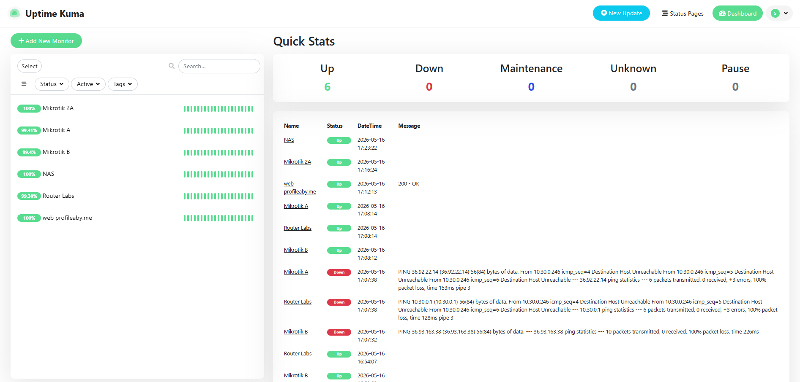
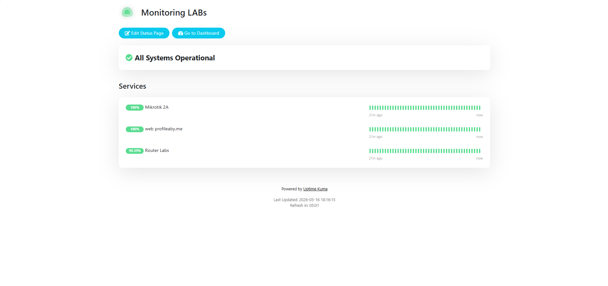

# Enterprise Network & Infrastructure Monitoring with Uptime Kuma

Tools for monitoring a Home LAB Server (Self-hosted) built on Proxmox VE using Docker. This system provides real-time visibility into the server's online/offline status as well as network health and performance.

## 🛠 Tech Stack
- **Platform:** Proxmox VE (LXC Container)
- **OS:** Ubuntu Server
- **Orchestration:** Docker Compose
- **Monitoring:** Uptime Kuma
- **Analytics:** Speedtest Tracker
- **Connectivity:** Cloudflare Tunnel 
- **Notifications:** Telegram Bot API

## Main Feature
- **Real-time Monitoring:** Monitor network device connections (Mikrotik/Switch) via ICMP.
- **Service Alerts:** Instant notification to Telegram if the network or connection is down.
- **Secure Remote Access:** Accessed through the Cloudflare subdomain without port forwarding.

  Example: https://monitor.profileaby.me/status/networklabs

##  Screenshots

## ⚙ Installation Method
1. Prerequisites
Ensure your server (or LXC container) has the following installed:
  - Docker (v20.10+)
  - Docker Compose (v2.0+)
  - Git

2. Clone the Repository
Start by cloning this repository to your local machine or server:

  git clone https://github.com/Handoko44/enterprise-network-health-monitor.git

  cd enterprise-network-health-monitor

4. Configuration
The system uses a docker-compose.yml file to manage the services. You can verify or edit the configuration (such as timezones or ports) using:

nano docker-compose.yml

Note: The default Timezone is set to Asia/Makassar (using your zone)

6. Deploy the Services
Launch the monitoring stack in detached mode (background):

docker-compose up -d

Docker will pull the necessary images and start Uptime Kuma

8. Accessing the Dashboards
Once the containers are running, you can access the web interfaces via your server's IP address:
Service,  Port,  URL
Uptime Kuma,  3001,  http://your-server-ip:3001
Speedtest Tracker,  8081,  http://your-server-ip:8081

## ⚙ Setup BOT Telegram
A. Real-time Notifications (Telegram)
To enable instant alerts on your mobile device:

  - Open Uptime Kuma and go to Settings > Notifications.
  - Click Setup Notification and select Telegram.
  - Provide your Bot Token (from @BotFather) and your Chat ID.
  - Test the notification to ensure you receive alerts when a service goes down.

B. Secure Remote Access (Cloudflare Tunnel)
To access your dashboards securely from outside your local network without opening ports on your router:

  - Set up a Cloudflare Tunnel (Cloudflare Zero Trust).
  - Point your subdomains (monitor.yourdomain.com) to the local IP and port of the services.
  - This ensures all traffic is encrypted and protected by Cloudflare's security layer.
